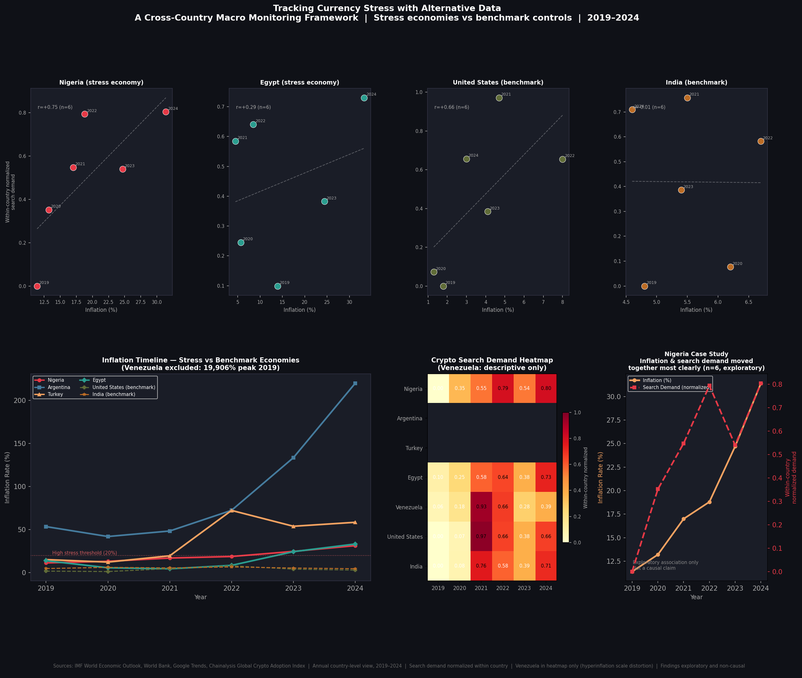

# Crypto Demand and Currency Stress
### A Cross-Country Macro Monitoring Framework | 2019–2024

> *Currency stress shows up in people's behavior before it shows up in official reports. This project tries to capture that gap.*

This is not a crypto investment thesis. It's a data engineering and monitoring project that uses crypto search behavior as a behavioral proxy signal for currency stress — built with Python, PostgreSQL, and Tableau.

---

## The Question

Official macroeconomic indicators are often lower-frequency and published with reporting delays, while behavioral reactions can surface in real time.

When people's purchasing power erodes, they search for Bitcoin, USDT, "dollar." That behavioral signal shows up in Google Trends potentially faster than it shows up in official publications.

Can that signal be used to monitor macro stress? This project doesn't prove it can. But it builds the framework to explore it — and finds some interesting patterns along the way.

---

## What I Built

An end-to-end analytics pipeline across 7 countries, 2019–2024:

- Ingested data from 5 sources — IMF, World Bank, Google Trends, Chainalysis, Yahoo Finance
- Cleaned, harmonized, and stored everything in PostgreSQL
- Ran exploratory correlation, regression, and lag-oriented analysis in Python
- Published an interactive Tableau dashboard

7 Python scripts. One PostgreSQL database. One Tableau dashboard. Full pipeline from raw API calls to published visualization.

**Tools:** Python, PostgreSQL, SQLAlchemy, pandas, scipy, statsmodels, matplotlib, Tableau Public

---

## Why These 7 Countries?

With 195 countries in the world, picking the right sample matters more than picking a large one.

The goal was to find economies that represented a genuine range of currency stress — from mild to catastrophic — while keeping the dataset manageable and the findings interpretable.

**Stress economies** were selected because they experienced documented currency deterioration during this period:

- 🇳🇬 **Nigeria** — naira depreciation, one of the world's highest crypto adoption rates
- 🇦🇷 **Argentina** — peso collapse, 219% inflation by 2024
- 🇹🇷 **Turkey** — sustained lira depreciation over multiple years
- 🇪🇬 **Egypt** — pound devaluation and IMF interventions

**Benchmark economies** were included deliberately as controls — places where crypto exists but currency stress does not drive adoption:

- 🇺🇸 **United States** — stable currency, large crypto market
- 🇮🇳 **India** — inflation present but strong digital payment infrastructure

**Venezuela** was included as a special case — hyperinflation so extreme it sits outside normal comparison but tells its own story.

**Iran** was collected but excluded from core analysis — sanctions make official FX data unreliable and fair comparison impossible.

This sample is small by design. The goal is depth and interpretability, not statistical power.

---

## Why 2019–2024?

Three reasons this window matters:

**2019** marks the beginning of the period when stablecoins, especially USDT, became a more visible part of cross-border and emerging-market crypto behavior, making related search demand more meaningful to track.

**2020–2021** brought COVID-driven currency stress, stimulus-driven inflation, and a global crypto surge — creating a natural stress test across multiple economies simultaneously.

**2022–2024** is where the real divergence happens — Argentina's peso collapse, Nigeria's naira freefall, Turkey's sustained lira crisis — all hitting their peak while US inflation spiked and then cooled. The contrast between stress and benchmark economies is sharpest in this window.

Going back further would lose the stablecoin signal. Going forward isn't possible yet with annual macro data. 2019–2024 is the right window.

---

## Why Nigeria Stood Out

Nigeria ranked highly in global crypto adoption and experienced significant currency deterioration during the study period, making it a useful focal case for this framework.

Within this dataset, Nigeria showed the strongest positive association between inflation and normalized crypto search demand (r=0.75, exploratory, n=6). That does not establish causation, but it suggests that in some high-stress economies, behavioral search signals may provide an additional monitoring layer alongside slower-moving official indicators.

---

## Dashboard

👉 **[View Live on Tableau Public](https://public.tableau.com/app/profile/chidvi.meduri/viz/CryptoCurrencyCollapse/Dashboard1)**

Four charts:
- **Inflation vs Crypto Demand Across Country-Years** — does higher inflation associate with higher crypto search demand?
- **Inflation Trends Across Selected Economies** — Argentina's peso collapse vs stable benchmarks
- **Crypto Demand by Country and Year** — heatmap showing which countries and years lit up
- **Nigeria: Inflation vs Crypto Demand** — the clearest case study in the sample (exploratory, r=0.75, n=6)

---

## What the Data Actually Showed

*Here's what was interesting — and where it surprised us.*

- No single universal pattern emerged across all 7 countries — crypto demand is not uniformly driven by macro stress. Context matters enormously
- **Nigeria** showed the clearest signal — inflation and crypto search demand moved together most closely (r=0.75, exploratory, n=6)
- **Argentina** hit 219% inflation in 2024 — the sharpest trajectory in the sample, and a strong candidate for future high-frequency analysis
- **Egypt** showed a weaker but directionally consistent pattern
- **United States** also showed rising crypto demand during higher-inflation periods, suggesting that similar surface signals may reflect different underlying behaviors across economies
- **India** showed comparatively flat crypto demand despite inflation pressure, which may reflect the presence of strong domestic digital-payment alternatives
- **Venezuela** was excluded from comparative charts — 19,906% inflation in 2019 would make every other country invisible on the same scale

---

## Data Sources

| Source | What it provided |
|---|---|
| IMF World Economic Outlook | Annual inflation by country |
| World Bank | FX depreciation, GDP per capita |
| Google Trends | Crypto/stablecoin search behavior |
| Chainalysis 2024 Report | Adoption rankings (descriptive only) |
| Yahoo Finance | BTC/ETH price history |

Methodology Notes (click to expand)

- Annual IMF/World Bank data limits frequency precision — findings are country-year level, not daily or monthly
- Google Trends values are normalized within each country on a 0–100 scale — equal values across regions do not imply equal absolute search volume, so cross-country comparisons are directional only
- Chainalysis adoption index is a composite rank — used as descriptive context only, not a regression target
- Venezuela and Iran treated as special cases due to data reliability issues
- Findings are exploratory and non-causal — this framework is intended for monitoring, not prediction

---

*Sources: IMF WEO, World Bank, Google Trends, Chainalysis. Annual country-level view, 2019–2024. Findings exploratory and non-causal.*